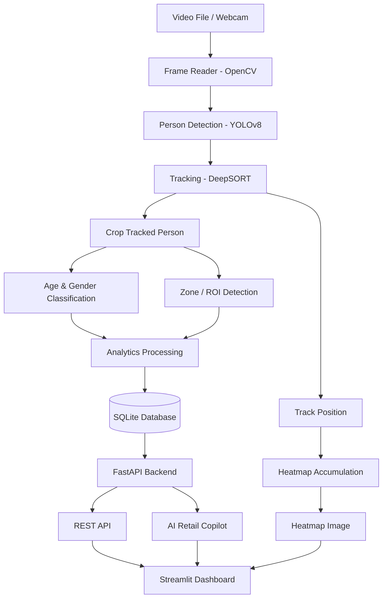

# 🛒 Autonomous Retail Intelligence System

An end-to-end **Edge AI and Computer Vision platform** that converts CCTV/store footage into real-time, actionable retail intelligence.

The system detects and tracks visitors, calculates zone-specific dwell times, analyzes demographics, generates 2D foot-traffic heatmaps, exposes analytics through REST APIs, and provides an interactive executive dashboard with automated AI-powered operational insights.

---

## 📌 Overview

The **Autonomous Retail Intelligence System** combines computer vision, multi-object tracking, spatial analytics, backend APIs, and business intelligence into a single platform.

It transforms raw CCTV footage into useful retail metrics such as:

* 👥 Visitor count and movement
* 🎯 Person detection and tracking
* 📍 Zone-specific visitor activity
* ⏱️ Customer dwell time
* 🧑‍🤝‍🧑 Estimated age-group and gender distribution
* 🗺️ Foot-traffic heatmaps
* 📊 Store performance analytics
* 🤖 AI-generated operational recommendations
* 📄 Executive PDF reports

---

# 🏗️ System Architecture




---

# 🔍 Architecture & Pipeline

The system is organized into four major layers.

## 1. 🎥 Ingestion & Perception Layer

### Video Ingestion

The system accepts either:

* Pre-recorded MP4 video
* Webcam input
* IP camera streams

Frames are captured sequentially using OpenCV's `VideoCapture`.

### Person Detection — YOLOv8

Each frame is processed using a pretrained **YOLOv8** object detection model.

The pipeline:

1. Processes the current video frame.
2. Detects objects.
3. Filters detections to the `person` class.
4. Extracts bounding boxes and confidence scores.

This isolates people from other objects in the scene.

### Multi-Object Tracking — DeepSORT

Detected people are passed to **DeepSORT**.

DeepSORT assigns a unique `track_id` to every detected person and attempts to maintain that identity across consecutive frames.

This allows the system to determine:

> "This person detected in frame 500 is the same person detected in frame 501."

Tracking continues even when a person is temporarily occluded.

---

# 2. 🧠 Feature Extraction & Analytics Layer

## Spatial ROI / Zone Detection

The system calculates the center or bottom-center point of every tracked person's bounding box.

This coordinate is checked against predefined **Regions of Interest (ROI)**.

Example zones:

```text
+---------------------------------------+
|                                       |
|              SHELF AREA               |
|                                       |
|        [ Zone 1 / Products ]          |
|                                       |
|                                       |
|------------- CUSTOMER AREA -----------|
|                                       |
|               CHECKOUT                |
+---------------------------------------+
```

This allows the system to determine whether a visitor is currently inside a specific store zone.

---

## ⏱️ Dwell Time Calculation

The system tracks how long each visitor remains inside a particular zone.

The calculation is based on:

```text
Dwell Time = Frames Spent in Zone / Video FPS
```

For example:

```text
FPS = 30
Frames in Zone = 300

Dwell Time = 300 / 30
           = 10 seconds
```

When the configured threshold is reached, the visitor session can be persisted to the database.

Example event:

```text
Track ID     : 42
Zone         : Shelf Area
Gender       : Male
Age Group    : Adult
Dwell Time   : 18.5 seconds
Timestamp    : 2026-10-08 10:30:21
```

---

## 🧑 Demographic Classification

The system crops the tracked person's bounding box and passes it through a pretrained classification model.

The model estimates:

* Gender
* Age group

These values are stored as telemetry associated with the visitor's tracking session.

> **Note:** Demographic predictions are model estimates and should not be treated as verified personal attributes.

---

## 🗄️ Database Logging

Processed events are persisted using:

* **SQLite**
* **SQLAlchemy ORM**

Example event fields:

| Field           | Description               |
| --------------- | ------------------------- |
| `track_id`      | Unique tracked visitor ID |
| `gender`        | Estimated gender          |
| `age_group`     | Estimated age group       |
| `zone`          | Store zone                |
| `dwell_seconds` | Time spent in zone        |
| `timestamp`     | Event timestamp           |

Database:

```text
retail_data.db
```

---

# 3. 🗺️ Spatial Density & Heatmap Layer

The system continuously records the movement coordinates of tracked visitors.

For every tracked person, the pipeline captures the approximate **bottom-center point of the bounding box**, representing the visitor's floor position.

These coordinates are accumulated into a 2D NumPy grid.

### Heatmap Processing

The raw movement data goes through the following pipeline:

```text
Visitor Coordinates
        ↓
2D NumPy Grid
        ↓
Gaussian Smoothing
        ↓
Intensity Normalization
        ↓
OpenCV JET Colormap
        ↓
heatmap_output.png
```

The resulting heatmap makes it easy to identify:

* High-traffic areas
* Low-traffic areas
* Product browsing zones
* Potential customer bottlenecks
* Checkout congestion
* Underutilized store space

Example output:

```text
Cold / Low Traffic
        ↓
      Blue
        ↓
     Green
        ↓
     Yellow
        ↓
Hot / High Traffic
        ↓
       Red
```

---

# 4. 🌐 Serving & Presentation Layer

## FastAPI Backend

The FastAPI service provides a decoupled REST interface for accessing analytics.

Main endpoints:

```text
GET /
GET /api/summary
GET /api/events
GET /api/copilot
```

This separation ensures that the dashboard does not need to directly interact with the computer vision processing loop.

---

## 🤖 AI Retail Copilot

The AI Retail Copilot analyzes the recorded store data and generates operational recommendations.

Example insights:

```text
⚠ High checkout dwell time detected.

Recommendation:
Consider opening an additional checkout counter
during peak traffic periods.
```

Other possible insights include:

* High visitor dwell time
* Underperforming zones
* High-traffic areas
* Checkout congestion
* Low customer engagement
* Potential staffing requirements

The current implementation uses rule-based analytical logic to convert store telemetry into actionable recommendations.

---

# 📊 Streamlit Executive Dashboard

The Streamlit dashboard provides an interactive interface for viewing store analytics.

The dashboard includes:

### Store Overview

Displays high-level KPIs such as:

* Total visitors
* Average dwell time
* Zone activity
* Demographic distribution

### Analytics Charts

Interactive charts visualize:

* Visitor distribution
* Dwell times
* Zone activity
* Demographic information

### Heatmap

Displays the generated:

```text
heatmap_output.png
```

for spatial movement analysis.

### Event Logs

Provides a detailed table containing individual visitor events.

### CSV Export

Processed event data can be exported for further analysis.

---

# 📊 Dashboard Features

## 1. Store Analytics Overview

Provides an executive-level summary of store activity.

Key metrics include:

```text
Total Visitors
Average Dwell Time
Zone Activity
Gender Distribution
Age Distribution
```

---

## 2. AI Retail Copilot

Automatically identifies potential operational issues and provides recommendations.

Example:

```text
🚨 Checkout congestion detected

Average checkout dwell time:
42 seconds

Suggested action:
Increase checkout capacity during peak hours.
```

---

## 3. Spatial Foot-Traffic Heatmap

Visualizes visitor movement throughout the store.

This can help identify:

* Customer hotspots
* Low-traffic areas
* Congested areas
* Product placement opportunities
* Store layout optimization opportunities

---

## 4. Demographic & Dwell Analysis

Provides analytics based on visitor sessions.

Example:

```text
Gender Distribution
-------------------
Male       52%
Female     48%

Average Dwell Time
------------------
Shelf Area       21.4 sec
Checkout         34.7 sec
```

---

## 5. Raw Event Logs

Provides access to individual tracking events.

Example:

| Track ID | Zone     | Gender | Age Group   | Dwell |
| -------: | -------- | ------ | ----------- | ----: |
|        1 | Shelf    | Male   | Adult       | 18.2s |
|        2 | Checkout | Female | Adult       | 35.4s |
|        3 | Shelf    | Male   | Young Adult | 12.7s |

The data can also be exported as CSV for additional analysis.

---

# ✨ Key Features

* 🎯 **Real-Time Person Detection** using YOLOv8
* 🧭 **Multi-Object Tracking** using DeepSORT
* 📍 **Zone / ROI Detection**
* ⏱️ **Visitor Dwell-Time Analytics**
* 🧑 **Estimated Demographic Classification**
* 🗺️ **2D Foot-Traffic Heatmaps**
* 🗄️ **SQLite Event Storage**
* ⚡ **FastAPI REST Backend**
* 📊 **Interactive Streamlit Dashboard**
* 🤖 **AI Retail Copilot**
* 📄 **Automated PDF Reporting**
* 📥 **CSV Event Export**
* 🔌 **Decoupled Computer Vision & Dashboard Architecture**

---

# 🛠️ Technology Stack

| Category             | Technology                 |
| -------------------- | -------------------------- |
| Programming Language | Python                     |
| Computer Vision      | OpenCV                     |
| Object Detection     | Ultralytics YOLOv8         |
| Object Tracking      | DeepSORT                   |
| Numerical Processing | NumPy                      |
| Data Analysis        | Pandas                     |
| Backend              | FastAPI                    |
| API Server           | Uvicorn                    |
| ORM                  | SQLAlchemy                 |
| Database             | SQLite                     |
| Dashboard            | Streamlit                  |
| Visualization        | Plotly Express             |
| Reporting            | ReportLab                  |
| Environment          | Python Virtual Environment |

---

# 📁 Project Structure

```text
retail-intelligence-system/
│
├── docs/
│   ├── flowchart.png
│   ├── dashboard_top.png
│   ├── dashboard_middle.png
│   └── dashboard_bottom.png
│
├── database.py
├── main_pipeline.py
├── api.py
├── dashboard.py
├── ai_copilot.py
├── generate_report.py
│
├── store_video.mp4
├── retail_data.db
└── heatmap_output.png
```

### File Responsibilities

| File                 | Responsibility                                                               |
| -------------------- | ---------------------------------------------------------------------------- |
| `main_pipeline.py`   | Video processing, YOLOv8 detection, DeepSORT tracking and heatmap generation |
| `database.py`        | SQLite database schema and SQLAlchemy event logging                          |
| `api.py`             | FastAPI application and REST endpoints                                       |
| `ai_copilot.py`      | Retail operational analysis and recommendations                              |
| `dashboard.py`       | Streamlit executive dashboard                                                |
| `generate_report.py` | Generates executive PDF reports                                              |
| `store_video.mp4`    | Input video source                                                           |
| `retail_data.db`     | Generated event database                                                     |
| `heatmap_output.png` | Generated visitor movement heatmap                                           |

---

# 🚀 Quick Start

## 1. Clone the Repository

```bash
git clone https://github.com/suryanshvaish1/retail-intelligence-system.git
cd retail-intelligence-system
```

---

## 2. Create a Virtual Environment

### Windows PowerShell

```powershell
python -m venv venv
.\venv\Scripts\Activate.ps1
```

### Linux / macOS

```bash
python3 -m venv venv
source venv/bin/activate
```

---

## 3. Install Dependencies

```bash
python -m pip install ultralytics deep-sort-realtime opencv-python fastapi uvicorn sqlalchemy streamlit plotly requests reportlab pandas
```

---

# ▶️ Running the System

The system consists of three primary processes.

Open **three separate terminals**.

---

## Terminal 1 — Computer Vision Pipeline

Run the AI processing pipeline:

```bash
python main_pipeline.py
```

This process:

1. Reads the input video.
2. Detects people using YOLOv8.
3. Tracks people using DeepSORT.
4. Calculates zone activity.
5. Computes dwell times.
6. Performs demographic classification.
7. Stores events in SQLite.
8. Generates the movement heatmap.

Generated files:

```text
retail_data.db
heatmap_output.png
```

---

## Terminal 2 — FastAPI Backend

Start the REST API:

```bash
uvicorn api:app --reload --port 8000
```

The API will be available at:

```text
http://127.0.0.1:8000
```

Interactive Swagger documentation:

```text
http://127.0.0.1:8000/docs
```

---

## Terminal 3 — Streamlit Dashboard

Start the dashboard:

```bash
streamlit run dashboard.py
```

The dashboard will normally be available at:

```text
http://localhost:8501
```

---

# 📄 Generate Executive PDF Report

After processing the video and generating database records, run:

```bash
python generate_report.py
```

This generates an executive-style PDF report containing summarized retail analytics.

---

# 📡 REST API Reference

| Endpoint       | Method | Description                               |
| -------------- | ------ | ----------------------------------------- |
| `/`            | `GET`  | API health check and endpoint information |
| `/docs`        | `GET`  | Interactive Swagger/OpenAPI documentation |
| `/api/summary` | `GET`  | Aggregated store KPIs                     |
| `/api/events`  | `GET`  | Recorded visitor events                   |
| `/api/copilot` | `GET`  | AI-generated operational recommendations  |

---

## `/api/summary`

Returns aggregated store analytics.

Example:

```json
{
  "total_visitors": 42,
  "average_dwell_seconds": 24.7,
  "male_percentage": 52,
  "female_percentage": 48
}
```

---

## `/api/events`

Returns individual visitor event records.

Example:

```json
[
  {
    "track_id": 1,
    "zone": "Shelf Area",
    "gender": "Male",
    "age_group": "Adult",
    "dwell_seconds": 18.4
  }
]
```

---

## `/api/copilot`

Returns operational recommendations generated from store analytics.

Example:

```json
{
  "alerts": [
    "High checkout dwell time detected",
    "Shelf Area has unusually high visitor activity"
  ]
}
```

---

# 🔄 End-to-End Data Flow

The complete processing flow can be summarized as:

```text
                CCTV / Video
                     │
                     ▼
              OpenCV Frame Reader
                     │
                     ▼
               YOLOv8 Detection
                     │
                     ▼
                DeepSORT
                     │
          ┌──────────┴──────────┐
          ▼                     ▼
   Visitor Analytics        Movement Data
          │                     │
   ┌──────┼──────┐              ▼
   ▼      ▼      ▼          Heatmap Engine
  Zone  Dwell  Demographic      │
   │      │      │              ▼
   └──────┴──────┘        heatmap_output.png
          │
          ▼
      SQLite DB
          │
          ▼
      FastAPI API
          │
          ▼
   Streamlit Dashboard
          │
          ▼
   Executive Insights
```

---

# 🎯 Business Use Cases

The platform can support several retail intelligence use cases.

### Store Layout Optimization

Identify areas receiving high or low customer traffic and optimize product placement accordingly.

### Customer Engagement

Measure how long visitors spend in specific product areas.

### Checkout Monitoring

Identify long dwell times around checkout areas and detect potential congestion.

### Staffing Optimization

Use traffic patterns to understand when additional employees may be required.

### Product Placement Analysis

Compare visitor activity around different store zones.

### Customer Journey Analysis

Understand how visitors move through different areas of a store.

### Executive Reporting

Generate summarized analytics and reports for store managers and business stakeholders.

---

# 🔐 Privacy & Responsible AI

This project is intended as a **technical retail analytics prototype**.

The demographic classification component produces model-based estimates and should not be considered verified personal information.

For production deployments, additional considerations should be implemented, including:

* Appropriate customer consent and notification
* Applicable privacy regulations
* Secure data storage
* Data retention policies
* Access control
* Model accuracy evaluation
* Bias and fairness evaluation
* Appropriate handling of CCTV footage

---

# 📈 Future Improvements

Potential improvements include:

* 🔴 Live CCTV/IP camera streaming
* 🧠 More advanced customer behavior analysis
* 📦 Product detection and shelf monitoring
* 🛍️ Product-level interaction tracking
* 🚨 Real-time anomaly detection
* 📱 Mobile analytics dashboard
* ☁️ Cloud-based deployment
* 🔔 Real-time alerts through Slack/email
* 🧠 LLM-powered retail analytics
* 📊 Historical trend analysis
* 👥 Customer journey visualization
* ⚡ GPU acceleration
* 🔄 Real-time streaming analytics
* 🏬 Multi-store analytics

---

# 🧪 Example Analytics Pipeline

A typical visitor session can look like:

```text
Visitor enters store
        ↓
YOLO detects person
        ↓
DeepSORT assigns Track ID = 17
        ↓
Visitor enters Shelf Zone
        ↓
System starts dwell timer
        ↓
Visitor remains for 22.6 seconds
        ↓
Demographic model estimates attributes
        ↓
Event stored in SQLite
        ↓
Movement coordinates added to heatmap
        ↓
FastAPI exposes analytics
        ↓
Streamlit displays metrics
        ↓
AI Copilot generates operational insight
```

---

# 📊 Project Output

After successfully running the pipeline, the system produces:

```text
retail_data.db
        │
        ├── Visitor Events
        ├── Zone Analytics
        ├── Dwell Times
        └── Demographic Telemetry

heatmap_output.png
        │
        └── Visitor Foot-Traffic Visualization
```

The dashboard then combines these outputs into an executive retail intelligence interface.

---

# 📜 License

This project is licensed under the **MIT License**.

---

# 👨‍💻 Author

**Suryansh Vaish**

GitHub:
https://github.com/suryanshvaish1

Repository:
https://github.com/suryanshvaish1/retail-intelligence-system

---

## ⭐ If You Find This Project Useful

Consider giving the repository a ⭐ on GitHub.
